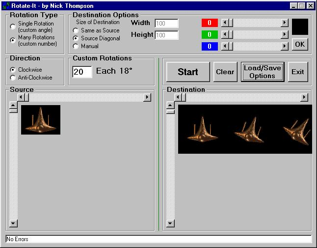



## Rotate\-It

### Description

This program will rotate an image into one or many different angles, it can also save them and put them all into the same picturebox to be saved, brilliant for making games using Bitblt. You can change many settings (view screenshot). (Note that to save you must select a save name before rotating because it saves them as it goes along). For multiple rotations e.g. 36 each 10 degrees it can save them using a base file name and adding a number to the end i.e. 1 to 36. Very Useful.
 
### More Info
 

             |
---                |---
**Submitted On**   |2000-06-25 14:46:00
**By**             |[Nick Thompson](https://github.com/Planet-Source-Code/PSCIndex/blob/master/ByAuthor/nick-thompson.md)
**Level**          |Advanced
**User Rating**    |4.8 (24 globes from 5 users)
**Compatibility**  |VB 5\.0, VB 6\.0
**Category**       |[Complete Applications](https://github.com/Planet-Source-Code/PSCIndex/blob/master/ByCategory/complete-applications__1-27.md)
**World**          |[Visual Basic](https://github.com/Planet-Source-Code/PSCIndex/blob/master/ByWorld/visual-basic.md)
**Archive File**   |[CODE\_UPLOAD71326252000\.zip](https://github.com/Planet-Source-Code/nick-thompson-rotate-it__1-9244/archive/master.zip)

